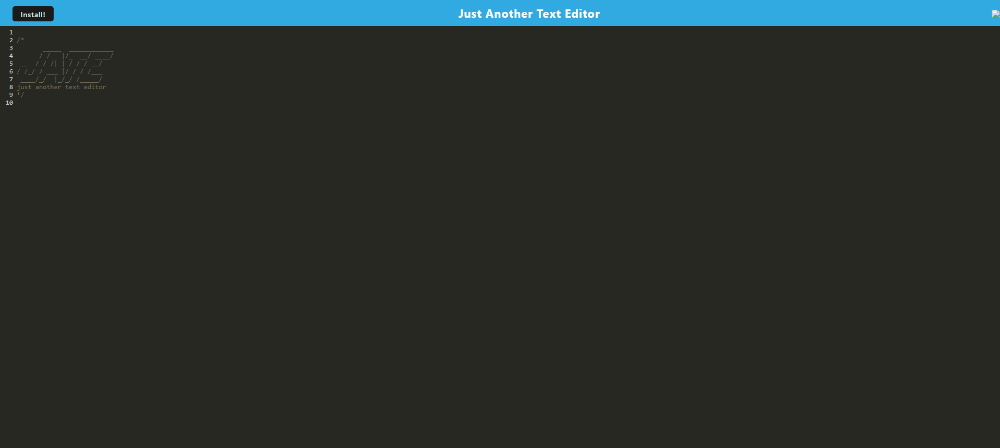

# PWA-Text-Editor-Project

## Description

This project was completed for the Columbia Coding Bootcamp. The purpose of this project was to create a PWA text editor that allows users to edit and download text, and save the text in the IndexedDB. This project uses a client-server model to create an online text editor.

## Installation

N/A

## Deployed Application

You can view this project on render at the following link: 

## Usage

Visit the deployed application. You can edit the text simply by typing in the body of the page. You can press install to download your work.

## Credits

I referenced previous projects and examples from the Columbia University Coding Bootcamp to assist in creating this page.

## Features

The application lets the user create and edit text that will be saved to their browser for future use. All of your work will be saved using IndexedDB. Users can also download their creations by clicking the install button.

## Screenshot of Application

